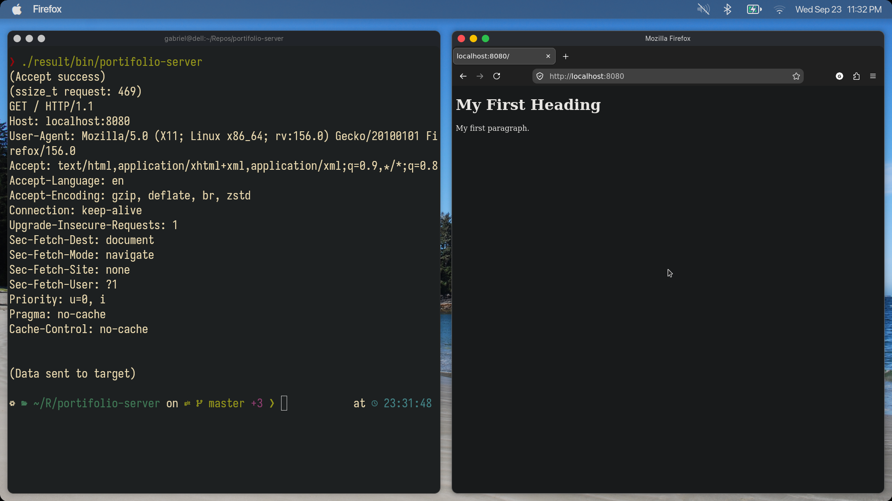

# Portifolio HTTP server
- A basic HTTP server using C and Linux/Posix sockets.

## Build:
- Use `nix build --print-build-logs` if you want to use nix.
- Otherwise, install the depencies and follow the commands in flake.nix.

## Todo:
- [x] Read a GET request from HTTP client
- [x] Send a GET response to a client
- [ ] Organise code
- [ ] Support other request types
- [ ] Improve/add on to the parser
- [ ] Allow for roughly defining routes (possibly with py/lua bindings)
- [ ] Consider security
- [ ] Make a portifolio
